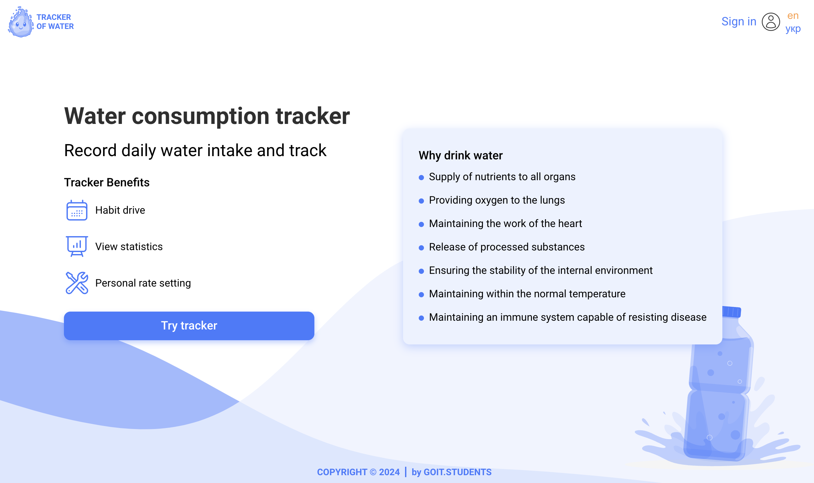

**Read in English: [Tracker of water](README.en.md).**
**Link to** [BACKEND](https://github.com/luzhnyak/aqua-backend)

# ТРЕКЕР СПОЖИВАННЯ ВОДИ

## Про проєкт:

Трекер споживання води: Дбай про себе та своє здоров'я!

Трекер споживання води - це проєкт спеціального додатку, розроблений, щоб спростити та покращити щоденну процедуру споживання води. Додаток розроблений з ціллю легкого відстежування кількості випитої води та встановлення персональних цілей, щоб піклуватись про своє здоров'я. Трекер споживання води має зручний та адаптивний інтерфейс, що полегшує відслідковування рівню випитої води без зайвих зусиль.
Змініть свої щоденні звички - завантажте трекер вже зараз!

Проєкт додатку дає змогу користувачу зареєстувати власний профіль, також за допомогою Google авторизації.
Вже зареєстрований користувач має можливість:

- налаштувати свій профіль, а саме додати та/або змінити персональні дані та фотографію;
- за допомогою вбудованої формули обчислити денну норму споживання води, або встановити її на власний розсуд;
- редагувати денну норму споживання води;
- додавати/редагувати/видаляти кількість випитої води за день;
- відслідковувати прогрес за графіком у відсотках кількість випитої води за день та за місяць.

Цей проєкт написаний на TypeScript у поєднанні з React JS для фронтенду та Node.js для бекенду, комбінуючи ці технології для ефективної та надійної розробки. Також, проєкт додатку доступний англійською та українською мовами для глобального та інклюзивного використання.

## Технології, які використовувались

**Front-end** 
`TypeScript` `React` `ReduxToolkit` `ReduxPersist` `Axios` `HTML/CSS` `Formik`
`React Spring` `Swiper` `Clsx` `Chart.js` `i18next`

**Back-end** 
`Node.js` `Express` `Mongoose` `Swagger` `Cloudinary`

## Команда розробників, які працювали над проєктом:

1. **Олег Лужняк** - Team leader. Відповідальний за: розгортання проекту, розгортання серверу, структуру проекту, технічне супроводження, налаштування маршрутизації, реалізацію Google авторизації та написання на TypeScript.
2. **Ірина Шевченко** - Scrum master. Відповідальна за: панель прогресу спожитої води, модальне вікно додавання та редагування випитої води, реалізацію анімації завантажувача.
3. **Анна Бойчук** - Front-end розробник. Відповідальна за: список води спожитої за день, таблицю статистики за місяць, загальну щоденну статистику та діаграму споживання води на місяць.
4. **Анна Мацарська** - Front-end розробник. Відповідальна за: підключення API, налаштування управління станом за допомогою redux та redux-persist, Footer із модальним вікном членів нашої команди.
5. **Ігор Хоренко** - Back-end розробник. Відповідальний за: API Endpoints для води, структурування бази даних, написання контролерів для всього обсягу випитої води, води спожитої окремо за день та за місяць.
6. **Галина Ластівка** - Front-end розробник. Відповідальна за: написання сторінок реєстрації та логінізації.
7. **Вікторія Литвин** - Front-end розробник. Відповідальна за: модальне вікно встановлення та редагування денної норми води та вітальну сторінку.
8. **Даніїл Чернов** - Back-end розробник. Відповідальний за: API Endpoints для авторизації користувача та денної норми споживача, Swagger та оновлення токена.
9. **Андрій Заяць** - Full-stack розробник. Відповідальний за: документацію Swagger, сторінку забутого пароля та сторінку оновлення пароля (backend + frontend), маршрутизацію, анімацію, надсилання листа верифікації.
10. **Катерина Бачкало** - Front-end розробник. Відповідальна за: Header, модальне вікно налаштування даних користувача та двомовну підтримку.
